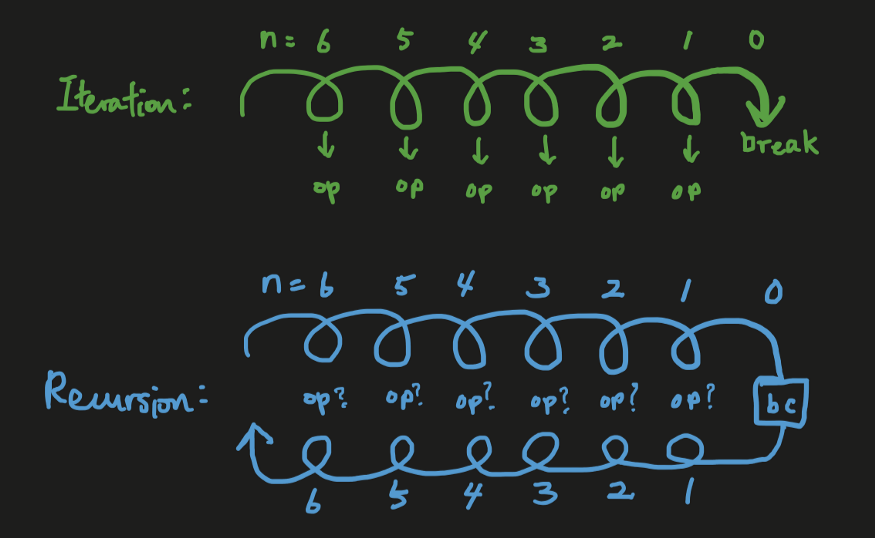
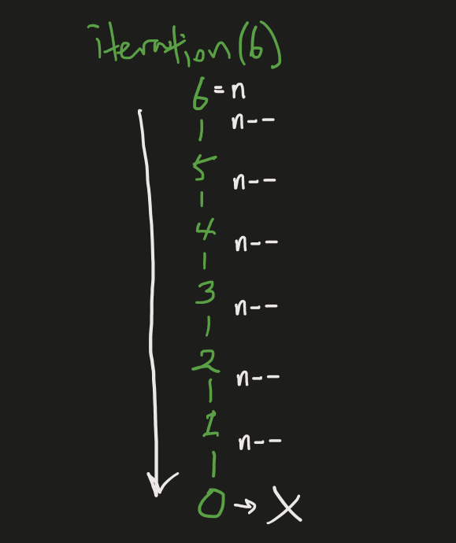
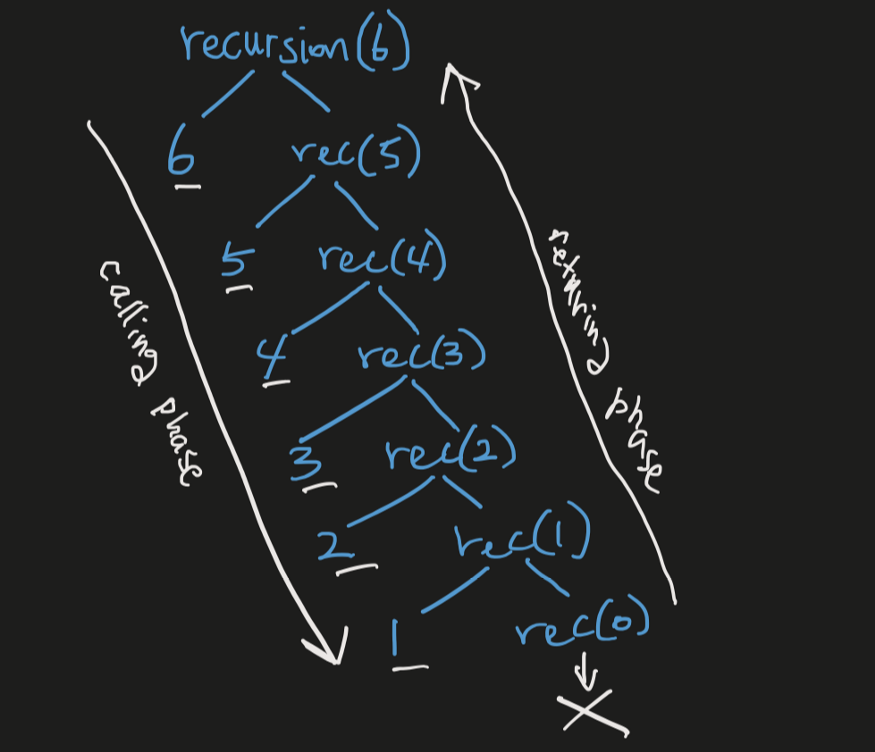

# Recursion

- [Recursion](#recursion)
  - [Intro](#intro)
  - [Parts Of A Recursive Algorithm:](#parts-of-a-recursive-algorithm)
  - [Recursion vs. Iteration](#recursion-vs-iteration)
  - [The Two Phases of Recursion](#the-two-phases-of-recursion)
  - [Recursion is like Inception](#recursion-is-like-inception)
  - [Recursion in Code](#recursion-in-code)
    - [Iteration](#iteration)
    - [Tail Recursion](#tail-recursion)
    - [Head Recursion](#head-recursion)
    - [A More Complex Recursion Example](#a-more-complex-recursion-example)
    - [Visualizing CallStack 🚀🚀🚀](#visualizing-callstack-)
  - [Principle of Mathematical Induction (PMI) and Recursion](#principle-of-mathematical-induction-pmi-and-recursion)
    - [Steps for solving using PMI:](#steps-for-solving-using-pmi)
  - [Changing Python Recursion Limit](#changing-python-recursion-limit)


```python
"""
jupyter nbconvert --to markdown recursion.ipynb --output README.md
"""
```

## Intro

```sh
n! = n * (n - 1) * (n - 2) * ...... * 1
n! = n * (n - 1)!

fact(n) = n * fact(n - 1)
fact(n - 1) = (n - 1) * fact(n - 2)

0! = 1
```

`Recursion` is a problem-solving technique that involves breaking a problem into smaller instances of the same problem (also called `subproblems`) until we get a small enough **subproblem having a trivial solution**. We can say that recursion is “defining a problem in terms of itself” as it involves a function calling itself with a base case to terminate the infinite loop.

- [https://medium.com/@shishir09/what-is-recursion-in-programming-239d30d12cfe](https://medium.com/@shishir09/what-is-recursion-in-programming-239d30d12cfe)
- [https://medium.com/free-code-camp/how-recursion-works-explained-with-flowcharts-and-a-video-de61f40cb7f9](https://medium.com/free-code-camp/how-recursion-works-explained-with-flowcharts-and-a-video-de61f40cb7f9)
- [https://medium.com/analytics-vidhya/understanding-recursion-in-python-f4a8cacce478](https://medium.com/analytics-vidhya/understanding-recursion-in-python-f4a8cacce478)
- [https://realpython.com/python-thinking-recursively/](https://realpython.com/python-thinking-recursively/)


## Parts Of A Recursive Algorithm:


1. `Base Case`:It is that step where we have to stop recursion and whose value we know beforehand.Therefore while writing any recursive algorithm the first step is to figure out its base case.For example:While finding the factorial of a number, the base case is `fact(1)=1` since(`1! = 1`).

2. `Recursive Call`:Here we keep on dividing the problems into subproblems until we reach the base case.Once we reach the base case we start combining the solution of all the subproblems to get to the solution of the main problem.For example : while computing the factorial of a number the recursive call is `fact(n)=n*fact(n-1)`

## Recursion vs. Iteration


Let’s recap what we already know first. What is recursion?

> Simply, recursion is a loop.

Recursion is almost always compared to iteration, which is also a loop. If recursion and iteration are both loops, how are they different?

Let’s look at two of the most prominent differences between recursion and iteration:

- `Recursion takes additional stack space` — We know that recursion takes extra memory stack space for each recursive calls, thus potentially having larger space complexity vs. iteration.
- `Recursion enables cleaner, more readable code` — Despite requiring more space, using recursion can allow your code to be a lot more readable vs. iteration.

## The Two Phases of Recursion


Recursion is a function that repeatedly calls itself in smaller forms with the idea that a complex problem can be solved more easily by solving a smaller version of the same problem.

What recursion is doing is repeated calling a smaller and smaller version of itself, until you have the smallest possible case that is so small that you can simply solve it immediately **→ this smallest case is the base case**. Then you use the answer to this base case to answer the next smallest problem, and then the next, and then the next, and so on, until you are back to the original problem that you began with.

Did you notice the two phases of recursion?

- We have one phase going toward the base case.
- We have another phase coming back from the base case.

The first phase of going from the original recursive call toward the base case is called the **calling phase**.
The second phase of coming back from the base case to the original recursive call is called the **returning phase**.

> This is the main difference between recursion and iteration:

**Iteration only has a `calling phase`, while recursion has a `calling phase` and a `returning phase`.**

The reason recursion is difficult to fully grasp at first, is that the loop of recursion has two phases, and this makes it difficult to see the full combining effect of each recursive call’s results into the final result.

For iteration, this is simple because the loop goes just one way → _you simply do the same thing in every iteration, period_.


<div align="center">

</div>

For recursion, I have denoted `“op”` with a question mark. This is because in recursion, we have two phases and _a recursive call’s operation can be performed either in the calling phase_ or in the _returning phase_, depending on how the recursion function is designed.

- When operations are performed in the `calling phase`, **they are performed as soon as the recursive call is made**. This is similar to how iteration works. The operation is done first, and then its inner recursive call is made.

- When the operation is performed in the `returning phase`, **recursive calls are made first**. When a recursive call is made, it first calls its inner recursive call, which calls its own inner recursive call, and so on until the final recursive call with the base case is made. Then, as the recursion returns back toward the original recursive call, operations for each recursive call that have been waiting for the preceding recursive call operation to terminate, are now performed.

Here is the key to fully understanding how the results of each recursive call is combined into the final result: we need to understand WHEN the operations of each recursive call is performed.

## Recursion is like Inception

If you have watched the movie `Inception`, you will notice a striking similarity between recursion and inception. ***Dream within a dream within a dream vs. recursive call within a recursive call within a recursive call.***

***With a specific goal in mind, you devise a dream and go into it.*** Inside that dream, you create another dream and go into that, and then another dream inside that dream, and so on until you go into an innermost dream. This is the **calling phase**, or **going-into-the-dreams phase**. The innermost dream is the base case.

***Now, to achieve your goals and live a happy life back in reality, you have to come out of the dreams***. You must first awake from the innermost dream, then the dream above that, and then the one above that, and so on until you are finally back out into reality. This is the **returning phase**, or **coming-back-to-reality** phase.

How the final result of the recursion is achieved depends on how the operations of each recursion call are performed.

**There can be two ways to achieve your goals through inception:**

- ***You can perform the necessary operations for each dream as you go in to the innermost dream***. When you have reached the innermost dream, you have *already done all of the necessary operations for each dream*. All you need to do now is to simply awake from each dream like bam bam bam until you are back out into reality. **Notice the order of goals achieved: the goal for the outermost dream is achieved first and the innermost dream last.**

- ***Or, you can first go into the innermost dream by entering through all the dreams, and then perform necessary operations as you awake from the dreams***. After achieving your goal for the innermost dream, you awake from that dream. Inside the next dream, you again perform your necessary operations and achieve your goal for that dream. You will continue these operations for each dream until you are awake from the last dream that you began with, and back out into reality. **Notice the order of goals achieved: the goal for the innermost dream is achieved first and the outermost dream last.**

- You can also combine these two ways. You can perform some operations on your way into inner dreams and perform some others as you come out of the dreams. For example, you can set up some bombs in a dream on your way into the innermost dream, and then as you awake from the dreams and reach this dream again on your way out to reality, you can trigger the bomb to explode.

What you can notice in this inception analogy is that *how the inception is designed (or how the recursion is designed) affects how your goal is achieved*. To put it another way, your inception or recursion function should be designed in a specific way, including the timing of operations, to achieve your intended goals.

## Recursion in Code


### Iteration


```python
def itr(n):
	while n > 0:
		print(n,end=" ")
		n-=1

itr(5)
```

    5 4 3 2 1

<div align="center">

</div>

### Tail Recursion

This same result can be implemented using recursion as follows:


```python
def recursion(n):
    if (n > 0):
        print(n,end=" ")
        recursion(n - 1)

recursion(6)
```

    6 5 4 3 2 1

The first recursion call is made with `recursion(6)`. As long as `n > 0`, it will print `n` and then call the next recursive call. `recursion(6)` prints `6` and then calls `recursion(5)`. This call will print `5` and then call `recursion(4)`. This process will continue until `recursion(0)` is called.


When `recursion(0)` is called, `n = 0`, so the recursive call terminates without performing anything. Since `recursion(0)` has terminated, we are now back at `recursion(1)` call, which have already performed its operation (printing `1`) before calling `recursion(0)`. Since both operations (`print(1)` & `recursion(0)`) of `recursion(1)` are now finished, `recursion(1)` terminates and we are now back at `recursion(2)` call. This continues until we return back to `recursion(6)`, after which our recursion is done.

<div align="center">

</div>

Notice how all the necessary operations were already performed when we have reached the base case recursive call of `recursion(0)`. All the operations are performed in the calling phase. As we return back from the base case in the returning phase, nothing else is actually done except simply terminating each recursive call.

This is an example of tail recursion. _**Tail recursion** is a type of recursion in which the recursive call is the LAST operation of the recursive function_, as in the above example. **In tail recursion, all operations are performed in the calling phase and nothing is done in the returning phase except for simply terminating the calls.**

> Tail recursion is similar to iteration.

- When you have a tail recursion, it is more efficient to write the code as an iteration, since they basically work the same way, but iteration has better space complexity.

- Remember all recursive functions can be written in iterative form and vice versa, but in some cases it is more difficult to write a recursive function in iterative form.

- Tail recursion is an example of recursion that can be easily written in iterative form, and in such cases, you should definitely write the code in iterative form and save memory space.

### Head Recursion

Now, let’s take the above example and make it a head recursion instead, in which all operations are performed in the returning phase:


```python
def recursion(n):
    if (n > 0):
        recursion(n - 1)
        print(n,end=" ")


recursion(6)
```

    1 2 3 4 5 6

Notice how everything is the same, except for the order of the two recursive case operations (`print(n)` and `recursion(n — 1)`).

In this recursion, the first recursion call `recursion(6)` is made. Since `n = 6 > 0`, `recursion(5)` is made. *Notice that `print(5)` can only be performed after the `recursion(5)` call is fully processed.* `recursion(5)` must call `recursion(4)` , which must call `recursion(3)` and so on until `recursion(0)` is called.

Since `n` is now equal to `0`, **base case** is reached and `recursion(0)` terminates without doing anything. Now we are back at `recursion(1)` call. Here, notice how we have NOT yet performed the `print(1)` operation, because we needed to first wait for the `recursion(0)` call to terminate. With `recursion(0)` now fully processed, `print(1)` operation is performed, `1` is printed. `recursion(1)` is now terminated and we are back at `recursion(2)` call. Again, we haven’t yet performed `print(2)`, so it is performed now, `2` is printed. `recursion(2)` is now terminated and we are back at `recursion(3)`. This continues until we are back to `recursion(6)`, which prints `6` and the recursion is done.

<div align="center">

</div>

This is a head recursion. *Head recursion is a type of recursion in which the recursive call is the FIRST operation of the recursive function*. **In a head recursion, all operations are performed in the returning phase.**

> Unlike tail recursions, head recursions cannot be easily converted to iteration.

If we were to write this head recursion in iterative form, we need to write it in such a way that the result will be 1 2 3 4 5 6.

If we write the above head recursion code in exactly the same order in iterative form, we would have the following:


```python
def iteration(n):
  while (n > 0):
    n-=1
    print(n,end=" ")

iteration(6);
```

    5 4 3 2 1 0

This is not what we were trying to get. To get 1 2 3 4 5 6, we have to find a different way to write the iteration function:


```python
def iteration(n):
	i=1
	while (i<=n):
		print(i, end=" ")
		i += 1


iteration(6)

```

    1 2 3 4 5 6

But, unlike tail recursion, it is more difficult to write head recursion in an iterative form, although it is possible.

### A More Complex Recursion Example

Now, let’s look at the following recursion function:


```python
def recursion(n):
  if (n > 0):
    print(n,end=" ");
    result = recursion(n - 1) + n;
    return result;

  return 0;

final = recursion(6);
print()
print(final)
```

    6 5 4 3 2 1
    21


Here, we have a combination of operations performed in the calling phase and in returning phase.

> Here is a simple rule for when an operation in a recursive function is performed:
1. Anything that comes **before** the recursive call is performed in the `calling phase`
2. Anything that comes after the recursive call is performed in the `returning phase`

In the above example, `print(n)` is performed in the **calling phase**. The first part is basically the same as the tail recursion example we have seen before.

The `+ n` and thus the `result = recursion(n — 1) + n` , and `return result` are all performed in the **returning phase**.

The final result of the above recursive function is thus:

- **`6 5 4 3 2 1` (performed in the calling phase)**
- **`21` (the final result of operations performed in the returning phase)**

### Visualizing CallStack 🚀🚀🚀


```python
# obj = {
# 	"fn": "factorial",
# 	"calling":True,
# 	"returns":3,
# }
callstack = ["fun(1)", "fun(322)", "fun(3)", "fun(4)", "fun(5)"]
def printStack(callstack,returns=2): # means last function in callstack will return 2
	callstackSize = len(callstack)
	if (callstackSize == 0): return
	maxLengthAmongListItem = max(len(i) for i in callstack)
	# stackPrintHeight = stackSize//2
	for i,el in reversed(list(enumerate(callstack))):
		if (not returns and i == callstackSize - 1):
			print("->",end="")
			print(f"│{el.center(maxLengthAmongListItem)}│",end="")
			print()
		elif (returns and i is (callstackSize -1)):
			print("  ",end="")
			print(f"│{el.center(maxLengthAmongListItem)}│",end="")
			print("⤸",end="")
			print(returns,end="")
			print()
		elif(returns and i is (callstackSize - 2)):
			print("->",end="")
			print(f"│{el.center(maxLengthAmongListItem)}│",end="")
			print()
		else:
			print("  ",end="")
			print(f"│{el.center(maxLengthAmongListItem)}│")
	print("  ", end="")
	print(f"└{'─'*(maxLengthAmongListItem)}┘")


printStack(callstack)

# center justify: https://stackoverflow.com/questions/44781484/python-string-formatter-align-center

```

      │ fun(5) │⤸2
    ->│ fun(4) │
      │ fun(3) │
      │fun(322)│
      │ fun(1) │
      └────────┘


```python
callstack = []
def factorial(n,callstack):
  callstack.append(f'f({n})')
  printStack(callstack,returns=None)
  if (n <= 1):
    printStack(callstack,returns=1)
    callstack.pop()
    return 1;
  else:
    result = factorial(n - 1,callstack) * n;
    printStack(callstack,returns=result)
    callstack.pop()
    printStack(callstack)
    return result;
final = factorial(5,callstack);
print()
print(final)

```

    ->│f(5)│
      └────┘
    ->│f(4)│
      │f(5)│
      └────┘
    ->│f(3)│
      │f(4)│
      │f(5)│
      └────┘
    ->│f(2)│
      │f(3)│
      │f(4)│
      │f(5)│
      └────┘
    ->│f(1)│
      │f(2)│
      │f(3)│
      │f(4)│
      │f(5)│
      └────┘
      │f(1)│⤸1
    ->│f(2)│
      │f(3)│
      │f(4)│
      │f(5)│
      └────┘
      │f(2)│⤸2
    ->│f(3)│
      │f(4)│
      │f(5)│
      └────┘
      │f(3)│⤸2
    ->│f(4)│
      │f(5)│
      └────┘
      │f(3)│⤸6
    ->│f(4)│
      │f(5)│
      └────┘
      │f(4)│⤸2
    ->│f(5)│
      └────┘
      │f(4)│⤸24
    ->│f(5)│
      └────┘
      │f(5)│⤸2
      └────┘
      │f(5)│⤸120
      └────┘

    120


## Principle of Mathematical Induction (PMI) and Recursion


Mathematical Induction is a technique to prove mathematical properties or formulations that are held for every natural numbers (0  and positive integer) or every whole number (positive integer)

<!-- $
\color{Green} \Large 0 + 1 + 2 + .... + n =\sum_{i=0}^{n} = \frac{n(n+1)}{2}

$ -->

<div align="center" >

</div>

For example, let us prove the equation for adding positive integers from `0 (or 1) to n`:

First, prove when `n = 0`:

<!-- $
\color{Green} \Large \frac{0(0+1)}{2} = 0

$ -->

<div align="center" >

</div>

Second, assume that the equation is true for adding up from `0 to n-1`:

<!-- $
\color{Green} \Large \color{Green} \Large 0 + 1 + 2 + .... + n - 1 = \frac{(n - 1)(n - 1 + 1)}{2}  = \frac{n(n - 1)}{2}

$ -->
<div align="center" >

</div>

Third, using the assumption in the previous step, show the equation is true for adding up from `0 to n`:


<!-- $
\color{Green} \Large \color{Green} \Large 0 + 1 + 2 + .... + n - 1 + n = \frac{n (n - 1)}{2} + n = \frac{n (n - 1) + 2n}{2} = \frac{n^{2} - n + 2n}{2} = \frac{n(n+1)}{2}

$ -->
<div align="center" >

</div>

This proves the equation works for every natural number because:

1. It works for the smallest number `0` (or 1 some times);
2. if the equation is true for one natural number then it is true for the next consecutive number;
3. True for 0 so true for 1, then true for 2, and true for 3 and so on… (this is the point where my mind was blown away!)

### Steps for solving using PMI:

1. Task 1: `f(0)`, `f(1)` is true
2. Task 2: Assume `f(k)` is True.
3. Task 3: Prove `f(k+1)` is True.


**- Prove that Prove the sum of first n integers is `n(n+1)/2`.**

<!-- $
\Large \color{Green} \sum_{}^{}n = \frac{n(n+1)}{2}

$ -->
i.e.

<div align="center" >

</div>

- Solution:

1. Task 1: `f(0)`, `f(1)` is true

<!-- $
\Large \color{Green} \sum_{}^{}1 = \frac{1(1+1)}{2} = 2/2 = 1
$ -->
<div align="center" >

</div>

<!-- $
\Large \color{Green} \sum_{}^{}k = \frac{k(k+1)}{2}
$ -->

  2. Task 2: Assume `f(k)` is True.


<div align="center" >

</div>

  3. Task 3: Prove `f(k+1)` is True.


<!-- $
\Large \color{Green} \sum_{}^{}k +1  = \frac{(k+1)(k+1+1)}{2} = \frac{(k+1)(k+2)}{2}

$ -->


<div align="center" >

</div>

<!-- $
\Large \color{Green} \sum_{}^{}k+1
  = \sum_{}^{}k+ (k+1)
  = \frac{k(k+1)}{2} + \frac{2(k+1)}{2}
  = (\frac{k+1}{2}) * (k+2)

$ -->

so,

<div align="center" >

</div>

I found mathematical induction and a recursive algorithm very similar in three points:
1. The basic case should be established; in the first example, n=0 case and in the second example, m = 0
2. Substitutions are used to go through the cases; in the first example, the last number in the series being used in the equation and in the second example, m and n being updated until m becomes 0 or less than 0
3. There is no set end: mathematical induction is used for infinitely many numbers of sequences and a recursive algorithm is used for an iteration without a set range of indices.

When I realized these similarities, it seems easier to know when to use a recursion algorithm and how to build it. Using these three things, a recursion algorithm is broken down into two parts that are also indicators when to use the algorithm:

1. Find a parameter value that represents a basic case and see it can end the loop that you are about to build
2. Find a pattern that is repeated and see if it can be expressed simply by updating values for variables

## Changing Python Recursion Limit

```python
import sys
sys.setrecursionlimit(100000)
```
