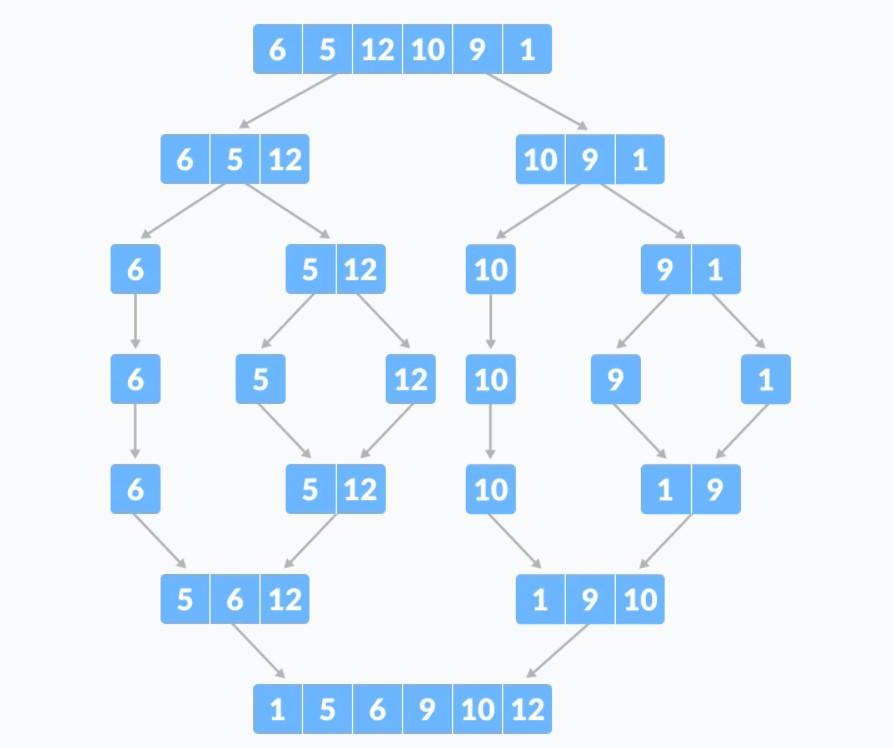
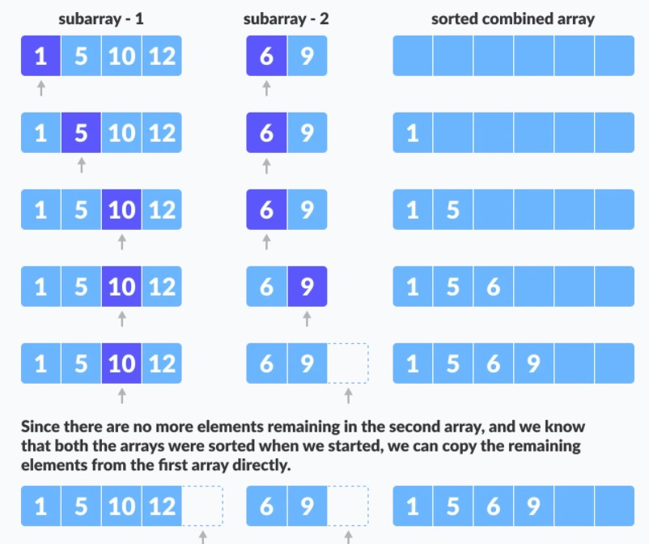
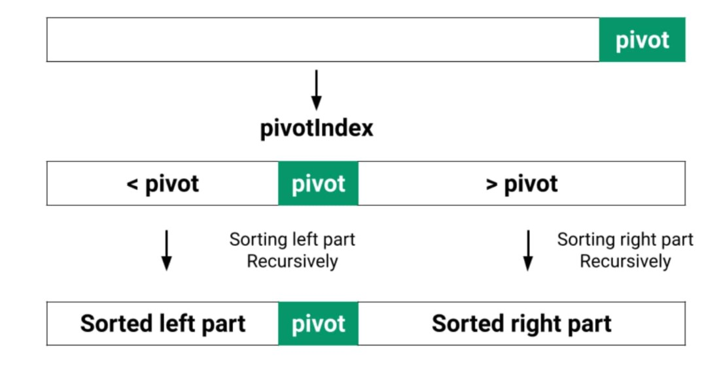
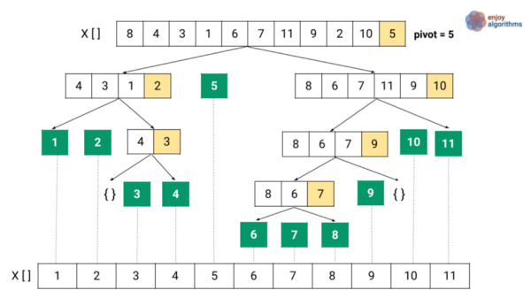
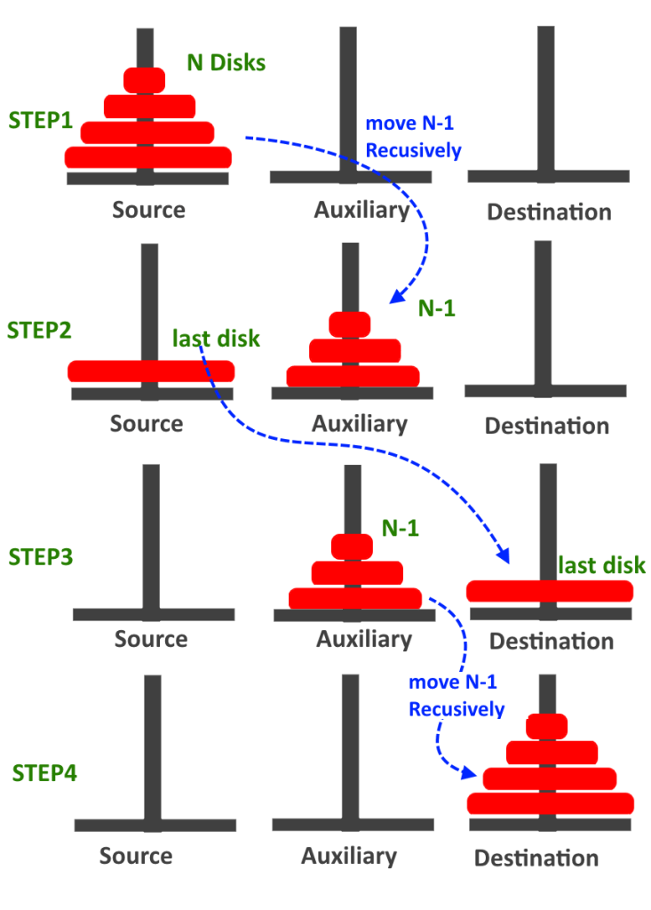

- [Problem Set 2](#problem-set-2)
	- [Recursion With Strings - replacing character](#recursion-with-strings---replacing-character)
		- [Remove X](#remove-x)
	- [Replace - Pi Multiple Character](#replace---pi-multiple-character)
		- [Remove Duplicates](#remove-duplicates)
	- [Binary Search](#binary-search)
	- [Merge Sort](#merge-sort)
		- [The merge Step of Merge Sort](#the-merge-step-of-merge-sort)
	- [Quick Sort - place element in it's right position](#quick-sort---place-element-in-its-right-position)
	- [Towers Of Hanoi](#towers-of-hanoi)

# Problem Set 2

## Recursion With Strings - replacing character

- `base` : len 0 -> do nothing
- `Induction Hypothesis` : our function will do the same for `l-1` sized string `x|......l-1|`
- `Induction Hypothesis` :
  -  `if s[0] == a`, then `return b+smallerOutput`
  - else `s[0] + smallerOutput`


```python
def replaceChar(s,a,b):
	if len(s) == 0:
		return s

	smallerOutput = replaceChar(s[1:],a,b)
	if s[0] == a:
		return b + smallerOutput
	else:
		return s[0] + smallerOutput

print(replaceChar("abcd",'a','b'))
print(replaceChar("abcd",'b','a'))
```

    bbcd
    aacd


### Remove X


```python
def removeX(s):
	if len(s) ==0:
		return s

	smallerOutput = removeX(s[1:])
	if s[0] == 'x':
		return smallerOutput
	else:
		return s[0] + smallerOutput

print(removeX("xabcdx"))
```

    abcd


## Replace - Pi Multiple Character


```python
def replacePi(s):
	if len(s) == 0 or len(s) == 1:
		return s

	if s[0] == 'p' and s[1] == 'i':
		smallerOutput = replacePi(s[2:])
		return '3.14' + smallerOutput
	else:
		smallerOutput = replacePi(s[1:])
		return s[0] + smallerOutput


print(replacePi("Pi:pi-p:pi"))

```

    Pi:3.14-p:3.14


### Remove Duplicates


```python
def removeDuplicate(s):
	if len(s) == 0 or len(s) == 1:
		return s

	if s[0] == s[1]:
		smallerOutput = removeDuplicate(s[2:])
		return smallerOutput
	else:
		smallerOutput = removeDuplicate(s[1:])
		return s[0] + smallerOutput


print(removeDuplicate("aabccba"))

```

    bba


## Binary Search


```python
def binarySearch(a,x,si,ei):
	if si > ei:
		return -1
	# calling phase
	mid = (si + ei)//2
	if a[mid] == x:
		return mid

	# recursive call
	elif a[mid] > x:
		return binarySearch(a,x,si,mid-1)
	else:
		return binarySearch(a,x,mid+1,ei)

print(binarySearch([1,2,3,4,5,6,7,8,9,10],5,0,9))
```

    4


## Merge Sort

<div align="center">

</div>

### The merge Step of Merge Sort

```python
# Have we reached the end of any of the arrays?
#    No:
#         Compare current elements of both arrays
#         Copy smaller element into sorted array
#         Move pointer of element containing smaller element
#     Yes:
#         Copy all remaining elements of non-empty array
```
<div align="center">

</div>


```python
def merge(a1,a2,a):
	i=0
	j=0
	k=0
# 	 i	   j
# a1[7]	a2[3,4]
#      ⬇️
# a[3,7]

# Until we reach either end of either `a1`  or `a2`, pick smaller among
# elements `a1` and `a2` and place them in the correct position at `a`
	while i < len(a1) and j < len(a2):
		if (a1[i]<a2[j]):
			a[k]=a1[i]
			k=k+1
			i=i+1
		else:
			a[k]=a2[j]
			k=k+1
			j=j+1
# merging left over elements
	while i < len(a1):
		a[k]=a1[i]
		k=k+1
		i=i+1
# 	 i	   		j
# a1[__]	a2[__,4]
#      ⬇️
# a[3,7,4]
	while j < len(a2):
		a[k]=a2[j]
		k=k+1
		j=j+1
```


```python
def merge_sort(a):
	if len(a) == 0 or len(a) ==1:
		return
	# calling phase
	mid = len(a)//2
	a1=a[0:mid]
	a2=a[mid:]
	merge_sort(a1)
	merge_sort(a2)
	# returning phase
	merge(a1,a2,a)
```


```python
a= [10,5,3,1,7,9,4,6,8,2]
merge_sort(a)
print(a)
```

    [1, 2, 3, 4, 5, 6, 7, 8, 9, 10]


## Quick Sort - place element in it's right position

<div align="center">

</div>

- Pick the Pivot in array.
- place pivot such that,
	- all elements in its left are smaller &
	- all elements in its right are larger.
- After placing pivot, left & right partitions are formed.

Again pick the pivot, recursively we divide the partitions further into  left & right partitions  until array is completely sorted.

<div align="center">

</div>


[https://www.enjoyalgorithms.com/blog/quick-sort-algorithm](https://www.enjoyalgorithms.com/blog/quick-sort-algorithm)


```python
def partition(a,si,ei):
	pivot = a[si]
# place pivot at the right place
	# find number of elements less than pivot
	c=0
	for i in range(si,ei+1):
		if a[i] < pivot:
			c=c+1
	# swap pivot with the last element less than pivot
	a[si+c],a[si] = a[si],a[si+c]
	pivot_index = si+c
# place pivot at the right place - end

# swap elements less than pivot to the left
# and elements greater than pivot to the right
	i=si
	j=ei

	while i<j:
		if a[i] < pivot:
			i=i+1
		elif a[j] >= pivot:
			j=j-1
		else:
			a[i],a[j]=a[j],a[i]
			i=i+1
			j=j-1
	return pivot_index
```


```python
def quick_sort(a,si,ei):
	if si >= ei:
		return
	# calling phase
	pivot_index = partition(a,si,ei)
	quick_sort(a,si,pivot_index-1)
	quick_sort(a,pivot_index+1,ei)

# test
a=[10,5,3,1,7,9,4,6,8,2]
quick_sort(a,0,len(a)-1)
print(a)
```

    [1, 2, 3, 4, 5, 6, 7, 8, 9, 10]


## Towers Of Hanoi

The Tower of Hanoi is a mathematical game or puzzle. It consists of three rods, and a number of disks of different sizes which can slide onto any rod.

The objective of the puzzle is to move the entire stack to another rod, obeying the following simple rules:

1. Only one disk is allowed to move at a time..
2. Bigger disk cannot be placed on the top of smaller disk.


Approach:

- Recursively Move `N-1` disk from source to Auxiliary peg.
- Move the `last` disk from source to destination.
- Recursively Move `N-1` disk from Auxiliary to destination peg.

<div align="center">

</div>


```python
def tower_of_hanoi(n,a,b,c):
	if n == 1:
		print("Move disk",n," from ",a,'-->',c)
		return
	tower_of_hanoi(n-1,a,c,b) # move n-1 disks from a to b
	print("Move disk", n, " from ", a, '-->', c) # move nth disk from a to c
	tower_of_hanoi(n-1, b, a, c)  # move n-1 disks again from b to c
```


```python
tower_of_hanoi(4,'src','aux','dest')
```

    Move disk 1  from  src --> aux
    Move disk 2  from  src --> dest
    Move disk 1  from  aux --> dest
    Move disk 3  from  src --> aux
    Move disk 1  from  dest --> src
    Move disk 2  from  dest --> aux
    Move disk 1  from  src --> aux
    Move disk 4  from  src --> dest
    Move disk 1  from  aux --> dest
    Move disk 2  from  aux --> src
    Move disk 1  from  dest --> src
    Move disk 3  from  aux --> dest
    Move disk 1  from  src --> aux
    Move disk 2  from  src --> dest
    Move disk 1  from  aux --> dest

