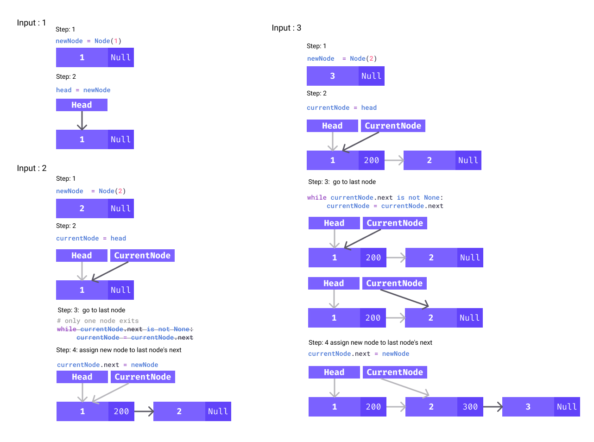
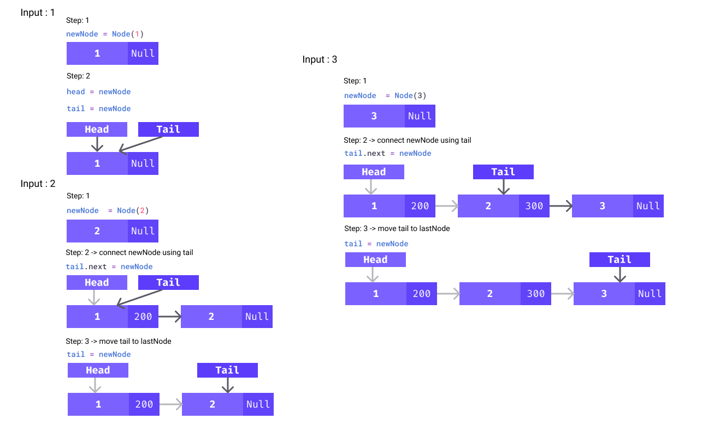
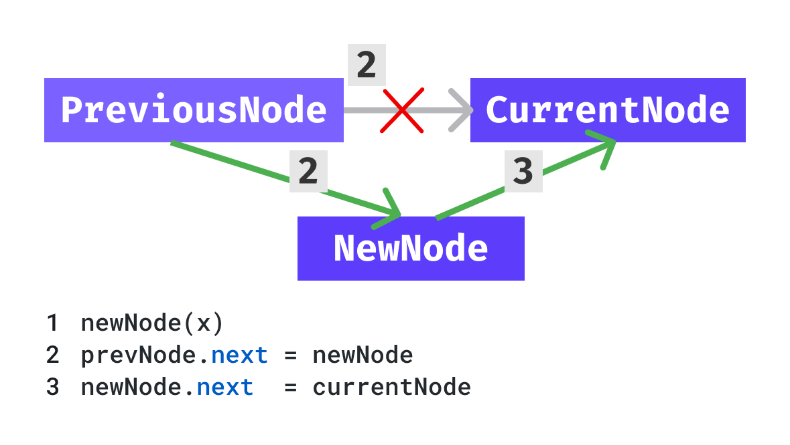

- [Linked List](#linked-list)
	- [Node Creation](#node-creation)
	- [Linked List Creation v1](#linked-list-creation-v1)
	- [Linked List Creation v2 - Optimized](#linked-list-creation-v2---optimized)
	- [Print ith node](#print-ith-node)
	- [Insert At Ith Position - Iteratively](#insert-at-ith-position---iteratively)
	- [Delete Node At Ith Position - Iteratively](#delete-node-at-ith-position---iteratively)
# Linked List

<!-- jupyter nbconvert --to markdown linked_list.ipynb --output README.md -->
<div align="center">

</div>

## Node Creation


```python
class Node:

	def __init__(self,data):
		self.data=data
		self.next=None


a= Node(1)
b= Node(2)
print(a.next, "<--- `a.next`")

#    ┏━━━┓      ┏━━━┓
#    ┃ a ┃----> ┃ b ┃
#    ┗━━━┛      ┗━━━┛
a.next=b


print(a.next,"<--- `a.next`, after `a.next=b`")
print(b, "<--- also the address `b`")
print(b.data)
print(a.next.data)

```

    None <--- `a.next`
    <__main__.Node object at 0x0000016B6BB289D0> <--- `a.next`, after `a.next=b`
    <__main__.Node object at 0x0000016B6BB289D0> <--- also the address `b`
    2
    2


## Linked List Creation v1

<div align="center">

</div>
<!-- width="800px" -->


```python
class Node:

	def __init__(self, data):
		self.data = data
		self.next = None

def takeInput():
	inputList= [int(ele) for ele in input().split()] # 1 2 3 -1 ----->  [1,2,3,-1]

	head = None
	for currentData in inputList:
		if currentData == -1:
			break

		newNode = Node(currentData)
		# fist node
		if head is None:
			head = newNode
		else:
			currentNode = head # do not change the value of head
			# go to last node
			while currentNode.next is not None:
				currentNode = currentNode.next
			# assign new node to last node's next
			currentNode.next = newNode

	return head

def printList(head):
	count = 0
	while head is not None:
		print(str(head.data)+"->", end="")
		head = head.next
		count += 1
	print("None")
	print(count)
```


```python
head = takeInput() # 1 2 3 -1
printList(head)
```

    1->2->3->None
    3


## Linked List Creation v2 - Optimized

<div align="center">

</div>
<!-- width="800px" -->


```python
class Node:

	def __init__(self, data):
		self.data = data
		self.next = None


def takeInput():
	# 1 2 3 -1 ----->  [1,2,3,-1]
	inputList = [int(ele) for ele in input().split()]

	head = None
	for currentData in inputList:
		if currentData == -1:
			break

		newNode = Node(currentData)
		# fist node
		if head is None:
			head = newNode
			tail = newNode
		else:
			tail.next = newNode
			tail = newNode

	return head


def printList(head):
	while head is not None:
		print(str(head.data)+"->", end="")
		head = head.next
	print("None")

```


```python
head = takeInput()  # 1 2 3 -1
printList(head)
```

    1->2->3->None


## Print ith node

For a given a singly linked list of integers and a position 'i', print the node data at the 'i-th' position.


```python
class Node:

	def __init__(self, data):
		self.data = data
		self.next = None

def createLinkedList(inputList):
	head = None
	for currentData in inputList:
		newNode = Node(currentData)
		if head is None:
			head = newNode
			tail = newNode
		else:
			tail.next = newNode
			tail = newNode

	return head

def printList(head,pos):
	currentNode = head
	count = 0
	while count<pos and currentNode is not None:
		currentNode = currentNode.next
		count += 1
	print(currentNode.data)
```


```python
head = createLinkedList([1,2,3,4,5])
printList(head,2)
```

    3


## Insert At Ith Position - Iteratively

<div align="center">

</div>
<!-- width="800px" -->


```python
class Node:

	def __init__(self, data):
		self.data = data
		self.next = None


def create(inputList):
	head = None
	for currentData in inputList:
		newNode = Node(currentData)
		if head is None:
			head = newNode
			tail = newNode
		else:
			tail.next = newNode
			tail = newNode
	return head

def length(head):
	count = 0
	while head is not None:
		count += 1
		head = head.next
	return count

def printList(head):
	while head is not None:
		print(str(head.data)+"->", end="")
		head = head.next
	print("None")

def insertAtPos(head, data, pos):

	if pos < 0 or pos > length(head):
		return head

	count = 0
	previousNode = None
	currentNode = head

	# get currentNode at pos
	while count < pos:
		previousNode = currentNode
		currentNode = currentNode.next
		count += 1
	# 1
	newNode = Node(data)
	# 2
	if previousNode is not None:
		previousNode.next = newNode
	else:
		head = newNode
	# 3
	newNode.next = currentNode
	return head

```


```python
head = create([1, 2, 3, 4, 5])
printList(head)
head = insertAtPos(head, 10, 2)
printList(head)
head = insertAtPos(head, 20, 4)
printList(head)
```

    1->2->3->4->5->None
    1->2->10->3->4->5->None
    1->2->10->3->20->4->5->None


## Delete Node At Ith Position - Iteratively

<div align="center">
	
</div>


```python
def deleteAtPos(head, pos):

	if pos < 0 or pos >= length(head):
		return head

	count = 0
	previousNode = None
	currentNode = head
	nextNode = None

	# get currentNode at pos
	while count < pos:
		previousNode = currentNode
		currentNode = currentNode.next
		nextNode = currentNode.next
		count += 1
	# 1
	if previousNode is not None:
		if nextNode is None:
			previousNode.next = None
		previousNode.next = nextNode
	else:
		head = nextNode
	# 2
	del currentNode
	return head

```


```python
head = create([1,2])
printList(head)
head = deleteAtPos(head, 2)
printList(head)
head = create([1, 2,3])
printList(head)
head = deleteAtPos(head, 2)
printList(head)
head = create([1, 2, 3,4])
printList(head)
head = deleteAtPos(head, 2)
printList(head)

```

    1->2->None
    1->2->None
    1->2->3->None
    1->2->None
    1->2->3->4->None
    1->2->4->None

