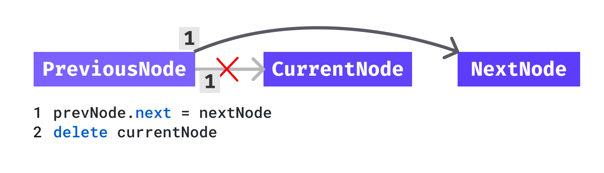
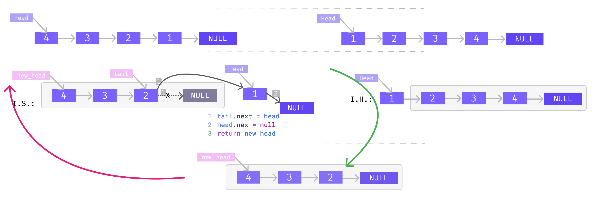

- [Linked List](#linked-list)
	- [Node Creation](#node-creation)
		- [👉 get your head around 🌟🌟](#-get-your-head-around-)
	- [Linked List Creation v1](#linked-list-creation-v1)
	- [Linked List Creation v2 - Optimized](#linked-list-creation-v2---optimized)
	- [Print ith node](#print-ith-node)
	- [Insert At Ith Position - Iteratively](#insert-at-ith-position---iteratively)
	- [Delete At Ith Position - Iteratively](#delete-at-ith-position---iteratively)
	- [Insert At Ith Position - Recursive](#insert-at-ith-position---recursive)
	- [Delete At Ith Position - Recursive](#delete-at-ith-position---recursive)
	- [Reverse Linked_List - Recursive](#reverse-linked_list---recursive)
		- [Optimized: finding tail easily](#optimized-finding-tail-easily)

# Linked List

<!--
jupyter nbconvert --to markdown linked_list.ipynb --output README.md
 -->
<div align="center">

</div>

## Node Creation

```python
class Node:

 def __init__(self,data):
  self.data=data
  self.next=None


a= Node(1)
b= Node(2)
print(a.next, "<--- `a.next`")

#    ┏━━━┓      ┏━━━┓
#    ┃ a ┃----> ┃ b ┃
#    ┗━━━┛      ┗━━━┛
a.next=b


print(a.next,"<--- `a.next`, after `a.next=b`")
print(b, "<--- also the address `b`")
print(b.data)
print(a.next.data)

```

    None <--- `a.next`
    <__main__.Node object at 0x0000016B6BB289D0> <--- `a.next`, after `a.next=b`
    <__main__.Node object at 0x0000016B6BB289D0> <--- also the address `b`
    2
    2

### 👉 get your head around 🌟🌟

<div align="center">

</div>

## Linked List Creation v1

<div align="center">

</div>
<!-- width="800px" -->

```python
class Node:

 def __init__(self, data):
  self.data = data
  self.next = None

def takeInput():
 inputList= [int(ele) for ele in input().split()] # 1 2 3 -1 ----->  [1,2,3,-1]

 head = None
 for currentData in inputList:
  if currentData == -1:
   break

  newNode = Node(currentData)
  # fist node
  if head is None:
   head = newNode
  else:
   currentNode = head # do not change the value of head
   # go to last node
   while currentNode.next is not None:
    currentNode = currentNode.next
   # assign new node to last node's next
   currentNode.next = newNode

 return head

def printList(head):
 count = 0
 while head is not None:
  print(str(head.data)+"->", end="")
  head = head.next
  count += 1
 print("None")
 print(count)
```

```python
head = takeInput() # 1 2 3 -1
printList(head)
```

    1->2->3->None
    3

## Linked List Creation v2 - Optimized

<div align="center">

</div>
<!-- width="800px" -->

```python
class Node:

 def __init__(self, data):
  self.data = data
  self.next = None


def takeInput():
 # 1 2 3 -1 ----->  [1,2,3,-1]
 inputList = [int(ele) for ele in input().split()]

 head = None
 for currentData in inputList:
  if currentData == -1:
   break

  newNode = Node(currentData)
  # fist node
  if head is None:
   head = newNode
   tail = newNode
  else:
   tail.next = newNode
   tail = newNode

 return head


def printList(head):
 while head is not None:
  print(str(head.data)+"->", end="")
  head = head.next
 print("None")

```

```python
head = takeInput()  # 1 2 3 -1
printList(head)
```

    1->2->3->None

## Print ith node

For a given a singly linked list of integers and a position 'i', print the node data at the 'i-th' position.

```python
class Node:

 def __init__(self, data):
  self.data = data
  self.next = None

def createLinkedList(inputList):
 head = None
 for currentData in inputList:
  newNode = Node(currentData)
  if head is None:
   head = newNode
   tail = newNode
  else:
   tail.next = newNode
   tail = newNode

 return head

def printList(head,pos):
 currentNode = head
 count = 0
 while count<pos and currentNode is not None:
  currentNode = currentNode.next
  count += 1
 print(currentNode.data)
```

```python
head = createLinkedList([1,2,3,4,5])
printList(head,2)
```

    3

## Insert At Ith Position - Iteratively

<div align="center">

</div>
<!-- width="800px" -->

```python
class Node:

 def __init__(self, data):
  self.data = data
  self.next = None


def create(inputList):
 head = None
 for currentData in inputList:
  newNode = Node(currentData)
  if head is None:
   head = newNode
   tail = newNode
  else:
   tail.next = newNode
   tail = newNode
 return head

def length(head):
 count = 0
 while head is not None:
  count += 1
  head = head.next
 return count

def printList(head):
 while head is not None:
  print(str(head.data)+"->", end="")
  head = head.next
 print("None")

def insertAtPos(head, data, pos):

 if pos < 0 or pos > length(head):
  return head

 count = 0
 previousNode = None
 currentNode = head

 # get currentNode at pos
 while count < pos:
  previousNode = currentNode
  currentNode = currentNode.next
  count += 1
 # 1
 newNode = Node(data)
 # 2
 if previousNode is not None:
  previousNode.next = newNode
 else:
  head = newNode
 # 3
 newNode.next = currentNode
 return head

```

```python
head = create([1, 2, 3, 4, 5])
printList(head)
head = insertAtPos(head, 10, 2)
printList(head)
head = insertAtPos(head, 20, 4)
printList(head)
```

    1->2->3->4->5->None
    1->2->10->3->4->5->None
    1->2->10->3->20->4->5->None

## Delete At Ith Position - Iteratively

<div align="center">
 
</div>

```python
def deleteAtPos(head, pos):

 if pos < 0 or pos >= length(head):
  return head

 count = 0
 previousNode = None
 currentNode = head
 nextNode = None

 # get currentNode at pos
 while count < pos:
  previousNode = currentNode
  currentNode = currentNode.next
  nextNode = currentNode.next
  count += 1
 # 1
 if previousNode is not None:
  if nextNode is None:
   previousNode.next = None
  previousNode.next = nextNode
 else:
  head = nextNode
 # 2
 del currentNode
 return head

```

```python
head = create([1,2])
printList(head)
head = deleteAtPos(head, 2)
printList(head)
head = create([1, 2,3])
printList(head)
head = deleteAtPos(head, 2)
printList(head)
head = create([1, 2, 3,4])
printList(head)
head = deleteAtPos(head, 2)
printList(head)

```

    1->2->None
    1->2->None
    1->2->3->None
    1->2->None
    1->2->3->4->None
    1->2->4->None

## Insert At Ith Position - Recursive

- `base` :
  - `pos<0` -> return `head`
  - `pos=0` -> perform insertion of `new_node` at head
- `Induction Hypothesis` :By traversing through the linked list, recursive function will return me `head` of a new linked list with `new_node` inserted at the beginning;e.g. `head->X->|3->4->NULL|`
- `Induction Step` : after the recursive function call, I will have the returned `head` of newly inserted node;
  - So, I'll have to attach leftovers of the original linked list to the new linked list. e.g. `1->2->X->3->4->NULL`

<div align="center">

</div>
<!-- width="800px" -->

```python
class Node:

 def __init__(self, data):
  self.data = data
  self.next = None


def create(inputList):
 head = None
 for currentData in inputList:
  newNode = Node(currentData)
  if head is None:
   head = newNode
   tail = newNode
  else:
   tail.next = newNode
   tail = newNode
 return head

def printList(head):
 while head is not None:
  print(str(head.data)+"->", end="")
  head = head.next
 print("None")


def insertAtPosR(head,pos,data):

 if pos < 0:
  return head

 if pos==0:
  newNode = Node(data) # point head to newNode
  newNode.next = head # insert newNolde at the beginning
  return newNode

 # if head is None:
 #  return None

 new_head = insertAtPosR(head.next,pos-1,data)
 head.next = new_head
 return head

```

```python
head = create([1, 2, 3, 4, 5])
printList(head)
head = insertAtPosR(head, 2, 10)
printList(head)
head = insertAtPosR(head, 2, 20)
printList(head)

```

    1->2->3->4->5->None
    1->2->10->3->4->5->None
    1->2->20->10->3->4->5->None

## Delete At Ith Position - Recursive

- `base` :
  - `pos<0` -> return `head`
  - `pos=0` -> perform deletion of `new_node` at head
- `Induction Hypothesis` :By traversing through the linked list, recursive function will return me `head` after deleting node from linked list.
- `Induction Step` : after the recursive function call, I will have the returned `head` of new linked list with deleted node;
  - So, I'll have to attach leftovers of the original linked list to the new linked list.

<div align="center">

</div>
<!-- width="800px" -->

```python
def deleteAtPosR(head, pos):

 if pos < 0:
  return head

 if pos ==0:
  new_head = head.next
  del head
  return new_head

 new_head = deleteAtPosR(head.next,pos-1)
 head.next = new_head
 return head
```

```python
head = create([1, 2, 3, 4, 5])
printList(head)
head = deleteAtPosR(head, 2)
printList(head)
```

    1->2->3->4->5->None
    1->2->4->5->None

## Reverse Linked_List - Recursive

- `base` :
  - `head == NULL` -> return `head`
- `Induction Hypothesis` :Assuming that the recursive function will reverse the linked list from `head.next` to `NULL`. i.e.  `4->3->2->NULL` is reversed by recursive function from list `head->1->2->3->4->NULL`
- `Induction Step` : after the recursive function call, I will have the returned `new_head` of reversed linked list.
  - So, I'll have to attach leftovers of the original linked list at the tail of reversed linked list.

<div align="center">

</div>
<!-- width="800px" -->

```python
class Node:

 def __init__(self, data):
  self.data = data
  self.next = None


def create(inputList):
 head = None
 for currentData in inputList:
  newNode = Node(currentData)
  if head is None:
   head = newNode
   tail = newNode
  else:
   tail.next = newNode
   tail = newNode
 return head


def printList(head):
 while head is not None:
  print(str(head.data)+"->", end="")
  head = head.next
 print("None")


def reverse_i(head):
 if head is None or head.next is None:
  return head
 # Induction Hypothesis: give the new_head of the reversed list from
 # `head.next` to the end of the list
 new_head = reverse_i(head.next)

 # Induction Step:
 # find tail
 tail = new_head
 while tail.next is not None:
  tail = tail.next
 # attach leftover at the tail
 tail.next = head
 head.next = None
 return new_head


```

```python
head = create([1, 2, 3, 4, 5])
printList(head)
head = reverse_i(head)
printList(head)

```

    1->2->3->4->5->None
    5->4->3->2->1->None

### Optimized: finding tail easily

we can skip finding tail as `head.next` (`2` in above example)  is the `tail` for that Induction Step.

```python

def reverse_ii(head):
 if head is None or head.next is None:
  return head
 # Induction Hypothesis: give the new_head of the reversed list from
 # `head.next` to the end of the list
 new_head = reverse_i(head.next)

 # Induction Step:
 # find tail
 tail = head.next
 # attach leftover at the tail
 tail.next = head
 head.next = None
 return new_head
```

```python
head = create([1, 2, 3, 4, 5])
printList(head)
head = reverse_ii(head)
printList(head)
```

    1->2->3->4->5->None
    5->4->3->2->1->None
