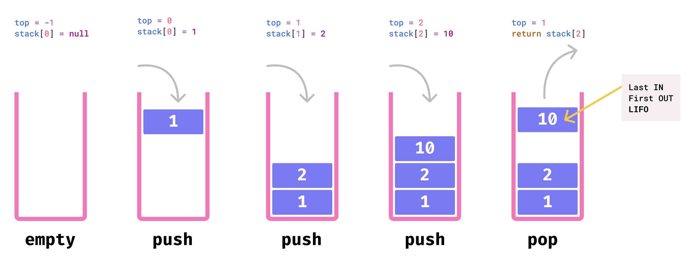

- [Stack](#stack)
	- [Stack Using Array](#stack-using-array)

# Stack

<!--
jupyter nbconvert --to markdown stack.ipynb --output README.md
 -->
<div align="center">

</div>

**Basic Operations of Stack**

There are some basic operations that allow us to perform different actions on a stack.

- `Push`: Add an element to the top of a stack
- `Pop`: Remove an element from the top of a stack
- `IsEmpty`: Check if the stack is empty
- `IsFull`: Check if the stack is full
- `Top`: Get the value of the top element without removing it
- `Size`: Get size of the stack


## Stack Using Array


```python
class Stack:

	def __init__(self) -> None:
		self.__data = []

	def push(self, value) -> None:
		self.__data.append(value)

	def pop(self) -> None:
		if self.is_empty():
			print("Stack is empty")
			return
		return self.__data.pop()

	def top(self) -> int:
		if self.is_empty():
			print("Stack is empty")
			return
		# return self.__data[-1]
		return self.__data[self.size() - 1]


	def size(self) -> int:
		return len(self.__data)

	def is_empty(self) -> bool:
		return self.size() == 0

```


```python
s = Stack()
s.push(1)
s.push(2)
print(s.top())
s.push(10)
print(s.top())
```

    2
    10


```python
while s.is_empty() is False:
	print(s.pop())
```

    10
    2
    1

