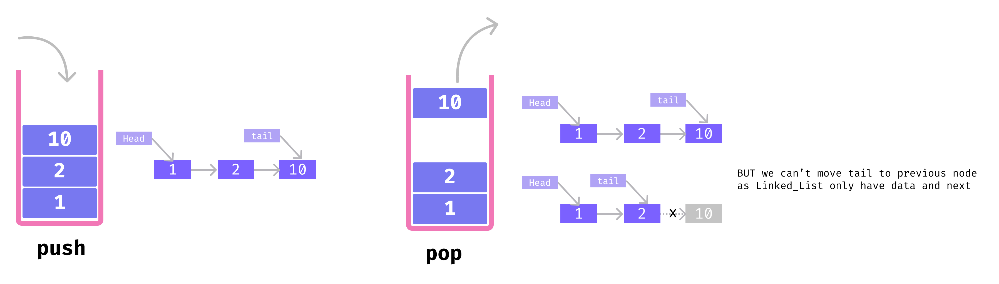
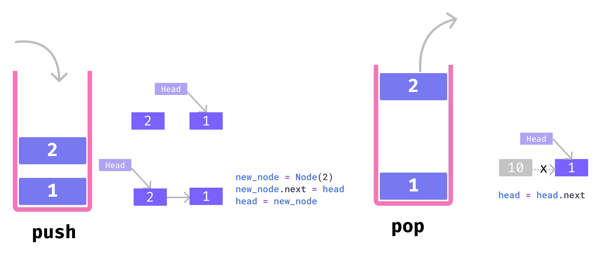
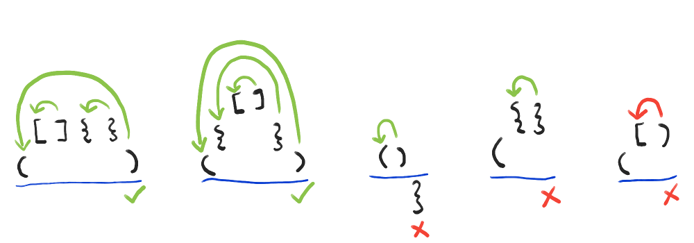
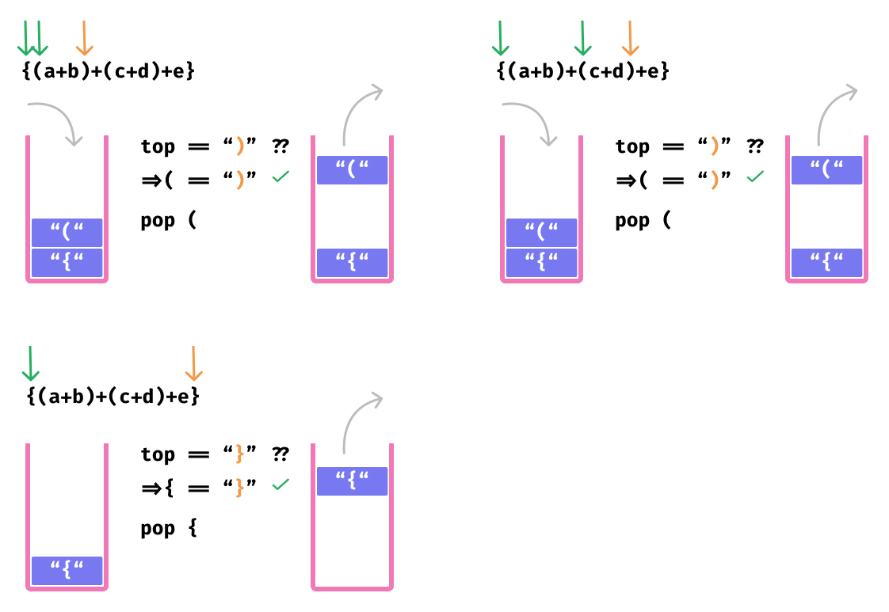
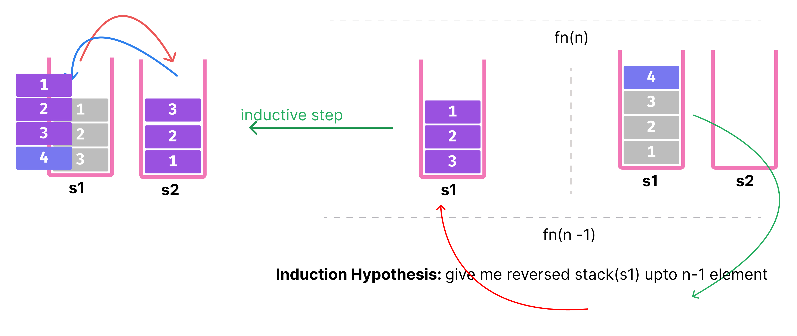

- [Stack](#stack)
	- [Stack Using Array](#stack-using-array)
	- [Stack Using Linked List](#stack-using-linked-list)
	- [In-Built Stack](#in-built-stack)
	- [Balanced Parenthesis Problem using Stack](#balanced-parenthesis-problem-using-stack)
	- [Reverse Stack](#reverse-stack)

# Stack

<!--
jupyter nbconvert --to markdown stack.ipynb --output README.md
 -->
<div align="center">

</div>

**Basic Operations of Stack**

There are some basic operations that allow us to perform different actions on a stack.

- `Push`: Add an element to the top of a stack
- `Pop`: Remove an element from the top of a stack
- `IsEmpty`: Check if the stack is empty
- `IsFull`: Check if the stack is full
- `Top`: Get the value of the top element without removing it
- `Size`: Get size of the stack


## Stack Using Array


```python
class Stack:

	def __init__(self) -> None:
		self.__data = []

	def push(self, value) -> None:
		self.__data.append(value)

	def pop(self) -> None:
		if self.is_empty():
			print("Stack is empty")
			return
		return self.__data.pop()

	def top(self) -> int:
		if self.is_empty():
			print("Stack is empty")
			return
		# return self.__data[-1]
		return self.__data[self.size() - 1]


	def size(self) -> int:
		return len(self.__data)

	def is_empty(self) -> bool:
		return self.size() == 0

```


```python
s = Stack()
s.push(1)
s.push(2)
print(s.top())
s.push(10)
print(s.top())
```

    2
    10


```python
while s.is_empty() is False:
	print(s.pop())
```

    10
    2
    1


## Stack Using Linked List

<div align="center">

</div>

- moving `tail` pointer back to the previous node is not possible in linked list as it has no concept of previous node

<div align="center">

</div>


```python

class Node:

	def __init__(self, value) -> None:
		self.data = value
		self.next = None

	def __str__(self) -> str:
		return str(self.value)

class Stack:

	def __init__(self) -> None:
		self.__head = None
		self.__count = 0

	def push(self, value) -> None:
		newNode = Node(value)
		newNode.next = self.__head
		self.__head = newNode
		self.__count += 1

	def pop(self) -> None:
		if self.is_empty():
			print("Stack is empty")
			return
		data = self.__head.data
		self.__head = self.__head.next
		self.__count -= 1
		return data

	def top(self) -> int:
		if self.is_empty():
			print("Stack is empty")
			return
		return self.__head.data

	def size(self) -> int:
		return self.__count

	def is_empty(self) -> bool:
		return self.size() == 0
```


```python
s = Stack()
s.push(1)
s.push(2)
print(s.top())
s.push(10)
print(s.top())
```

    2
    10


```python
while s.is_empty() is False:
	print(s.pop())
```

    10
    2
    1


## In-Built Stack

- list as stack


```python
s = [1,2,3]
s.append(4)
s.append(5)

print(s.pop())
print(s.pop())

print("TOP:", s[-1])
```

    5
    4
    TOP: 3


## Balanced Parenthesis Problem using Stack

<div align="center">

</div>

**Problem Description:** You are given with a string expression, write a program to find whether
brackets are balanced or not, i.e. if a bracket opens last, then it should get closed first. Print true
if the brackets are balanced, otherwise print false.

For example: `{ a + [ b+ (c + d)] + (e + f) }`
Here, all the brackets are balanced, so the output for this input string must be true.

**Algorithm to approach:**
1. You need to declare a Stack S.
2. Now, traverse the string expression.
   - If the current character of the string is an opening bracket`(‘(‘ or ‘{‘ or ‘[‘)`, then push it to the stack.
   - If the current character is a closing bracket `(‘)’` or `‘}’` or `‘]’)` then pop from stack and if the popped character is the matching opening bracket then fine, else parentheses are not balanced. This is because of the fact that in a balanced brackets expression, whichever bracket opens last, should be closed first.
   - After complete traversal, if there is some starting bracket left in stack then the expression is “not balanced” because this means there are some extra opening brackets.

Let us take an example:
`{ a + [ b+ (c + d)] + (e + f) }`

Make a stack S.
We have an opening bracket first, insert it into the stack.

```
       ┏━━━━━━━━
       ┃ { ┃
       ┗━━━━━━━━
```

Again an opening bracket, insert into the stack.


```
       ┏━━━━━━━━━━━━
       ┃ { ┃ [ ┃
       ┗━━━━━━━━━━━━
```

Again, an opening bracket, insert into the stack.


```
       ┏━━━━━━━━━━━━━━━━━━
       ┃ { ┃ [ ┃ ( ┃
       ┗━━━━━━━━━━━━━━━━━━
```


Now, we encounter a closing bracket, pop the topmost element from the stack and it matches the
closing bracket. Hence, we continue the process.


```
       ┏━━━━━━━━━━━━━━━━━━
       ┃ { ┃ [ ┃
       ┗━━━━━━━━━━━━━━━━━━
```


Again, we encounter a closing bracket, pop the topmost element from the stack and it matches
the closing bracket. Hence, we continue the process.


```
       ┏━━━━━━━━━━━━━━━━━━
       ┃ { ┃
       ┗━━━━━━━━━━━━━━━━━━
```

Again, we encounter a closing bracket, pop the topmost element from the stack and it matches
the closing bracket. Hence, we continue the process.


```
       ┏━━━━━━━━━━━━━━━━━━
       ┃
       ┗━━━━━━━━━━━━━━━━━━
```

Now, the string finished and we have an empty stack left, hence the brackets are balanced.

<div align="center">

</div>


```python
def isBalanced(string):
	stack = []
	for char in string:
		if char in '({[':
			stack.append(char)
		elif char == ')':
			if (not stack or stack[-1] != '('):
				return False
			stack.pop()
		elif char == '}':
			if (not stack or stack[-1] != '{'):
				return False
			stack.pop()
		elif char == ']':
			if (not stack or stack[-1] != '['):
				return False
			stack.pop()

	if(not stack):
		return True
	return False


string = "{a+[b+(c+d)]+(e+f)}"
print(isBalanced(string))
string = "{a+[b+(c+d)]+(e+f)"
print(isBalanced(string))

```

    True
    False


## Reverse Stack

<div align="center">

</div>


```python
def reverseStack(s1,s2):
	if (len(s1) <=1):
		return

	while (len(s1)!= 1):
		element = s1.pop()
		s2.append(element)

	lastElement = s1.pop()

	while(len(s2)!= 0):
		element = s2.pop()
		s1.append(element)

	reverseStack(s1,s2)
	s1.append(lastElement)


s1 = [1,2,3,4,5]
s2 = []
print(s1)
reverseStack(s1,s2)
print(s1)
while (len(s1)!= 0):
	print(s1.pop(),end=" ")

```

    [1, 2, 3, 4, 5]
    [5, 4, 3, 2, 1]
    1 2 3 4 5
