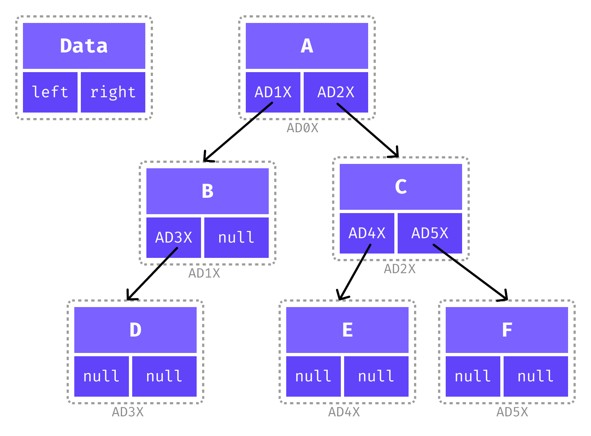
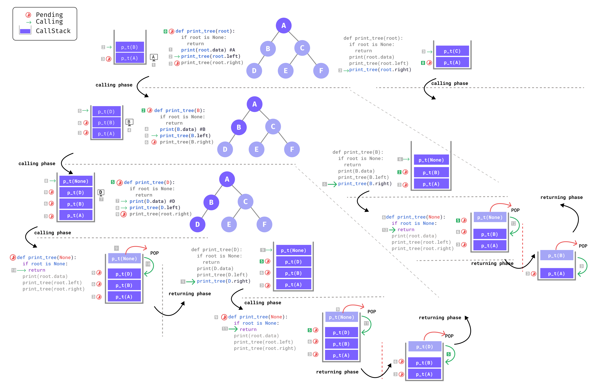

# Binary Tree

- [Binary Tree](#binary-tree)
	- [Introduction](#introduction)
	- [Creating Binary Tree](#creating-binary-tree)
	- [Printing Binary Tree](#printing-binary-tree)
		- [Print Nodes](#print-nodes)
			- [Print Node with  Left Child and Right Child](#print-node-with--left-child-and-right-child)


```python
"""
jupyter nbconvert --to markdown b_tree.ipynb --output README.md
"""

```

## Introduction


A binary tree is a tree data structure in which each parent node can have `0`,`1` or at most `2` children. Each node of a binary tree consists of three items:

- data item
- address of left child
- address of right child

<div align="center">

</div>

## Creating Binary Tree


```python
class BinaryTreeNode:
	def __init__(self, data):
		self.data = data
		self.left = None
		self.right = None

	def __str__(self):
		return str(self.data)
```


```python
btn1 = BinaryTreeNode(1)
btn2 = BinaryTreeNode(2)
btn3 = BinaryTreeNode(3)
```


```python
btn1.left = btn2
btn1.right = btn3
```

## Printing Binary Tree

### Print Nodes

- `base case`: Check if the given node is `null`. If `null`, then `return` from the function.
- `Inductive step`: Print the data/root of the given node.
- `Hypothesis`: recursive function will print
  - left subtree
  - then, right subtree


```python
def print_tree(root):
	if root is None:
		return
	print(root.data)
	print_tree(root.left)
	print_tree(root.right)

print_tree(btn1)
```

    1
    2
    3


<div align="center">

</div>


```python
btn = BinaryTreeNode("A")
btn1 = BinaryTreeNode("B")
btn2 = BinaryTreeNode("C")
btn.left = btn1
btn.right = btn2
btn3 = BinaryTreeNode("D")
btn1.left = btn3
btn4 = BinaryTreeNode("E")
btn5 = BinaryTreeNode("F")
btn2.left = btn4
btn2.right = btn5
```

#### Print Node with  Left Child and Right Child


```python
def print_tree_details(root,):
	# print(l)
	if root is None:
		return
	# printing root node
	print(root.data,end=":")
	# printing left node
	if root.left != None:
		print("L->",root.left.data,end=",")

	# printing right node
	if root.right != None:
		print("R->",root.right.data,end="")
	print()
	print_tree_details(root.left)
	print_tree_details(root.right)

print_tree_details(btn)
```

    A:L-> B,R-> C
    B:L-> D,
    D:
    C:L-> E,R-> F
    E:
    F:

