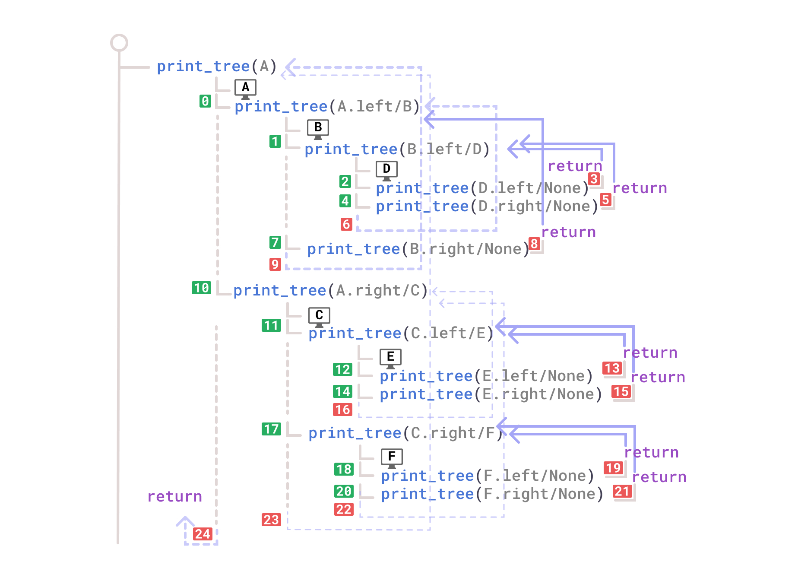
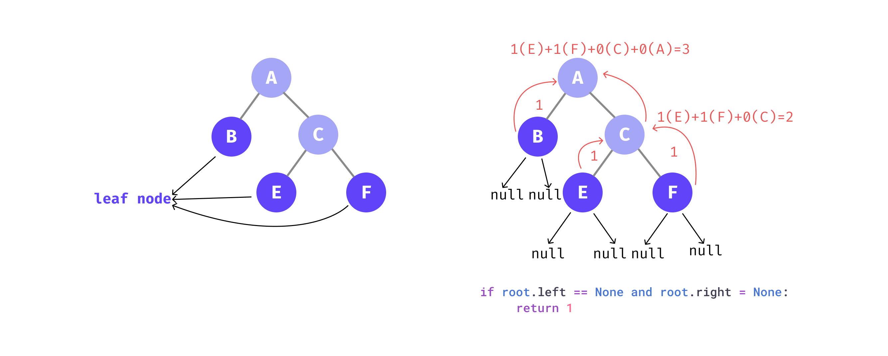

# Binary Tree

- [Binary Tree](#binary-tree)
	- [Introduction](#introduction)
	- [Creating Binary Tree](#creating-binary-tree)
	- [Printing Binary Tree](#printing-binary-tree)
		- [Print All Nodes](#print-all-nodes)
			- [Print Node with  Left Child and Right Child](#print-node-with--left-child-and-right-child)
		- [Print At Depth k](#print-at-depth-k)
	- [Input of Binary Tree](#input-of-binary-tree)
	- [Number of Nodes in Binary Tree](#number-of-nodes-in-binary-tree)
	- [Largest Node](#largest-node)
	- [Number of Leaf Nodes](#number-of-leaf-nodes)

```python
"""
cd .\05binary_tree\
jupyter nbconvert --to markdown b_tree.ipynb --output README.md
"""

```

## Introduction


A binary tree is a tree data structure in which each parent node can have `0`,`1` or at most `2` children. Each node of a binary tree consists of three items:

- data item
- address of left child
- address of right child

<div align="center">

</div>

## Creating Binary Tree


```python
class BinaryTreeNode:
	def __init__(self, data):
		self.data = data
		self.left = None
		self.right = None

	def __str__(self):
		return str(self.data)
```


```python
A = BinaryTreeNode("A")
B = BinaryTreeNode("B")
C = BinaryTreeNode("C")
D = BinaryTreeNode("D")
E = BinaryTreeNode("E")
F = BinaryTreeNode("F")

A.left = B
A.right = C
B.left = D
C.left = E
C.right = F
```

## Printing Binary Tree

### Print All Nodes

- `base case`: Check if the given node is `null`. If `null`, then `return` from the function.
- `Inductive step`: Print the data/root of the given node.
- `Hypothesis`: recursive function will print
  - left subtree
  - then, right subtree


```python
def print_tree(root):
	if root is None:
		return
	print(root.data)
	print_tree(root.left)
	print_tree(root.right)

print_tree(A)
```

    A
    B
    D
    C
    E
    F


<div align="center">

</div>

Here is a simple simulation of printing a binary tree.

<div align="center">

</div>

#### Print Node with  Left Child and Right Child


```python
def print_tree_details(root):
	# print(l)
	if root is None:
		return
	# printing root node
	print(root.data,end="->")
	# printing left node
	if root.left != None:
		print(f"L:{root.left.data}",end=",")
	# printing right node
	if root.right != None:
		print(f"R:{root.right.data}", end="")

	print()
	print_tree_details(root.left)
	print_tree_details(root.right)

print_tree_details(A)
```

    A->L:B,R:C
    B->L:D,
    D->
    C->L:E,R:F
    E->
    F->


### Print At Depth k


```python
def printDepthK(root, k):
	if root == None:
		return
	if k == 0:
		print(root.data)
		return
	printDepthK(root.left, k - 1)
	printDepthK(root.right, k - 1)

```


```python
printDepthK(A,2)
```

    D
    E
    F


```python
def printDepthKV2(root,k, d=0):
	if root == None:
		return
	if k == d:
		print(root.data)
		return
	printDepthKV2(root.left,k, d + 1)
	printDepthKV2(root.right, k, d + 1)

```


```python
printDepthKV2(A,2)
```

    D
    E
    F


## Input of Binary Tree


```python
def takeInput():
	rootData = int(input())
	if rootData == -1:
		return None

	root = BinaryTreeNode(rootData)
	leftTree = takeInput()
	rightTree = takeInput()
	root.left = leftTree
	root.right = rightTree
	return root

```


```python
root = takeInput() # 1 2 4 -1 -1 5 -1 -1 3 -1 7 -1 -1
print_tree_details(root)

```

    1->L:2,R:3
    2->L:4,R:5
    4->
    5->
    3->R:7
    7->


## Number of Nodes in Binary Tree

- `Base Case`: `if root == None: return 0`
- `Induction Hypothesis`:
  - leftTree will give total number of nodes in leftTree = `totalNodesInLeftTree`
  - rightTree will give total number of nodes in rightTree = `totalNodesInRightTree`
- `Recursive Step`:
  - `1(root) + totalNodesInLeftTree + totalNodesInRightTree = totalNodesInTree`


```python
def numNodes(root):
	if root == None:
		return 0
	totalNodesInLeftTree = numNodes(root.left)
	totalNodesInRightTree = numNodes(root.right)
	totalNodesInTree = 1 + totalNodesInLeftTree + totalNodesInRightTree
	return totalNodesInTree
```


```python
numNodes(A)
```


    6


## Largest Node

- `Base Case`: `if root == None: return -1`
- `Induction Hypothesis`:
  - leftTree will give the largest node in leftTree = `largestNodeInLeftTree`
  - rightTree will give largest node in rightTree = `largestNodeInRightTree`
- `Recursive Step`:
  - `Max(root,largestNodeInLeftTree, largestNodeInRightTree) = largestNodeInTree`


```python
A = BinaryTreeNode(10)
B = BinaryTreeNode(20)
C = BinaryTreeNode(5)
D = BinaryTreeNode(4)
E = BinaryTreeNode(3)

A.left = B
A.right = C
B.left = D
B.right = E

print_tree_details(A)
```

    10->L:20,R:5
    20->L:4,R:3
    4->
    3->
    5->


```python
def findLargestNode(root):
	if root ==None:
		return -1
	largestNodeInLeftTree = findLargestNode(root.left)
	largestNodeInRightTree = findLargestNode(root.right)
	largestNodeInTree = max(root.data, largestNodeInLeftTree, largestNodeInRightTree)
	return largestNodeInTree

```


```python
findLargestNode(A)
```


    20


## Number of Leaf Nodes

<div align="center">

</div>


```python
def numLeafNodes(root):
	if root == None:
		return 0
	# both both left and right are leaf nodes are None - means they are leaf nodes
	if root.left == None and root.right == None:
		return 1

	totalLeafNodesInLeftTree = numLeafNodes(root.left)
	totalLeafNodesInRightTree = numLeafNodes(root.right)
	totalLeafNodesInTree = totalLeafNodesInLeftTree + totalLeafNodesInRightTree
	return totalLeafNodesInTree

```


```python
numLeafNodes(A)
```


    3


