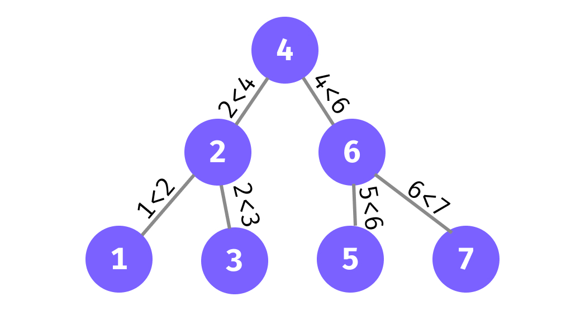
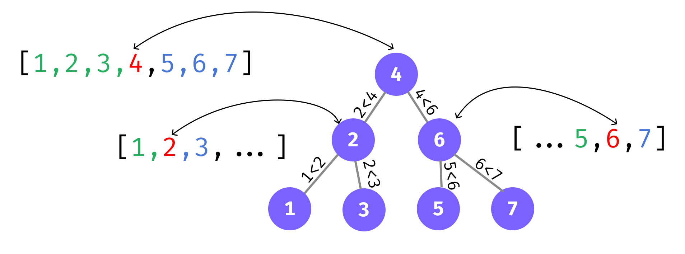
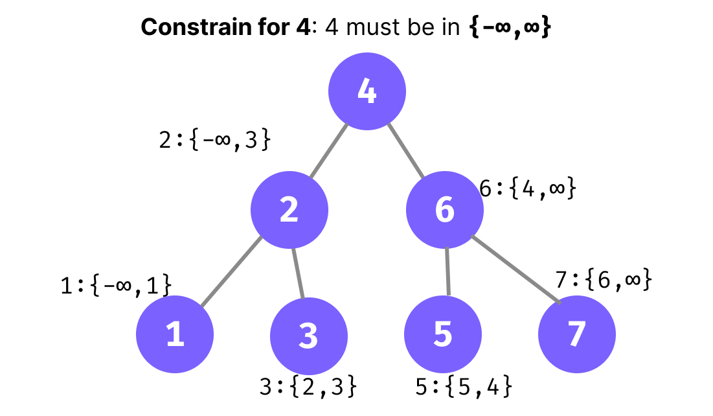

# Binary Search Tree

- [Binary Search Tree](#binary-search-tree)
	- [Introduction](#introduction)
	- [Search in a BST](#search-in-a-bst)
	- [Print Elements In Range K1 and K2](#print-elements-in-range-k1-and-k2)
	- [Convert Sorted Array To BST](#convert-sorted-array-to-bst)
	- [Check Is BST or Not](#check-is-bst-or-not)
		- [isBST Sol.1](#isbst-sol1)
		- [isBST Sol.2](#isbst-sol2)

```python
"""
cd .\0605binary_search_tree\
jupyter nbconvert --to markdown bst.ipynb --output README.md

"""
```

## Introduction

`Binary Search Tree` is a node-based binary tree data structure which has the following properties:

- The `left subtree `of a node contains only nodes with keys **`lesser`** than the node’s key.
- The `right subtree` of a node contains only nodes with keys **`greater`** than the node’s key.
- The `left and right subtree` each must also be a `binary search` tree.

<div align="center">

</div>

Time Complexity:
- Insertion: `O(n)`
- Search: `O(h)`; h is the height of the tree
- Deletion: `O(n)`


```python
class BinaryTreeNode:
	def __init__(self, data):
		self.data = data
		self.left = None
		self.right = None

	def __str__(self):
		return str(self.data)
```


```python
A = BinaryTreeNode(4)
B = BinaryTreeNode(2)
C = BinaryTreeNode(6)
D = BinaryTreeNode(1)
E = BinaryTreeNode(3)
F = BinaryTreeNode(5)
G = BinaryTreeNode(7)


A.left = B
A.right = C
B.left = D
B.right = E
C.left = F
C.right = G
```


```python
def print_tree_details(root):
	# print(l)
	if root is None:
		return
	# printing root node
	print(root.data,end="->")
	# printing left node
	if root.left != None:
		print(f"L:{root.left.data}",end=",")
	# printing right node
	if root.right != None:
		print(f"R:{root.right.data}", end="")

	print()
	print_tree_details(root.left)
	print_tree_details(root.right)

print_tree_details(A)
```

    4->L:2,R:6
    2->L:1,R:3
    1->
    3->
    6->L:5,R:7
    5->
    7->


## Search in a BST

- Base Case: `if root == None: return False` , `if root.data == x: return True`
- Recursive Step:
  - if `x < root.data`, search in the `left` subtree
  - if `x > root.data`, search in the `right` subtree


```python
def search(root,X):
	if root == None:
		return False
	if root.data == X:
		return True

	if root.data > X:
		return search(root.left,X)
	else:
		return search(root.right,X)
```


```python
search(A,5),search(A,10)
```


    (True, False)


##  Print Elements In Range K1 and K2

- Base Case: `if root == None: return`
- Recursive Step:
  - `if k1<root.data`, print the `left` subtree
  - `if k2>root.data`, print the `right` subtree
  - `if k1<=root.data<=k2`, print the `root`


```python
def printBetweenK1k2(root,k1,k2):
	if root == None:
		return
	if root.data > k1:
		printBetweenK1k2(root.left,k1,k2)
	if root.data >= k1 and root.data <= k2:
		print(root.data,end=" ")
	if root.data < k2:
		printBetweenK1k2(root.right,k1,k2)

printBetweenK1k2(A,2,6)
```

    2 3 4 5 6

## Convert Sorted Array To BST

<div align="center">

</div>

- Base Case: `if len(arr) == 0: return None`
- Recursive Step:
  - take the middle element of the array and make it the root
  - take left side of the array, pass it to the function recursively to make the left subtree
  - take right side of the array, pass it to the function recursively to make the right subtree


```python
def sortedArrayToBST(arr):
	if len(arr) == 0:
		return None
	mid = len(arr)//2
	root = BinaryTreeNode(arr[mid])
	root.left = sortedArrayToBST(arr[:mid])
	root.right = sortedArrayToBST(arr[mid+1:])
	return root
```


```python
print_tree_details(sortedArrayToBST([1,2,3,4,5,6,7]))
```

    4->L:2,R:6
    2->L:1,R:3
    1->
    3->
    6->L:5,R:7
    5->
    7->


## Check Is BST or Not

### isBST Sol.1

- Base Case: `if root == None: return True`
- Inductive Hypothesis:
  - The left subtree will be a BST(`isBST(root.left)`)
  - The right subtree will be a BST(`isBST(root.right)`)
- Recursive Step:
  - `Condition 1`: check if the `max` value in the `left subtree` is less than the `root`
  - `Condition 2`: check if the `min` value in the `right subtree` is greater than the `root`
  - if both the conditions are `true`, then the tree is a BST
  - Now we need to check if the left and right subtree are also BSTs


```python
def getMaximumFromLeft(root):
	if root == None:
		return -10000
	leftMax = getMaximumFromLeft(root.left)
	rightMax = getMaximumFromLeft(root.right)
	return max(root.data,leftMax,rightMax)

def getMinimumFromRight(root):
	if root == None:
		return 10000
	leftMin = getMinimumFromRight(root.left)
	rightMin = getMinimumFromRight(root.right)
	return min(root.data,leftMin,rightMin)


def isBST(root):
	if root == None:
		return True

	leftMax = getMaximumFromLeft(root.left)
	rightMin = getMinimumFromRight(root.right)

	if root.data > leftMax and root.data < rightMin and isBST(root.left) and isBST(root.right):
		return True
	else:
		return False

isBST(A)

```


    True


```python
isBST(sortedArrayToBST([1,2,3,4,5,6,7])), isBST(sortedArrayToBST([5,2,3,4,5,6,8]))
```


    (True, False)


### isBST Sol.2

We can check constraints on the `min` and `max` values that a node can take like the following way:

<div align="center">

</div>


```python
def isBST3(root,min_range,max_range):
	if root == None:
		return True

	if root.data < min_range or root.data > max_range:
		return False

	isLeftBSTConstrainSatisfies = isBST3(root.left,min_range,root.data-1)
	isRightBSTConstrainSatisfies = isBST3(root.right,root.data,max_range)

	return isLeftBSTConstrainSatisfies and isRightBSTConstrainSatisfies
```


```python
isBST3(sortedArrayToBST([1,2,3,4,5,6,7]),-10000,10000), isBST3(sortedArrayToBST([5,2,3,4,5,6,8]),-10000,10000)
```


    (True, False)


